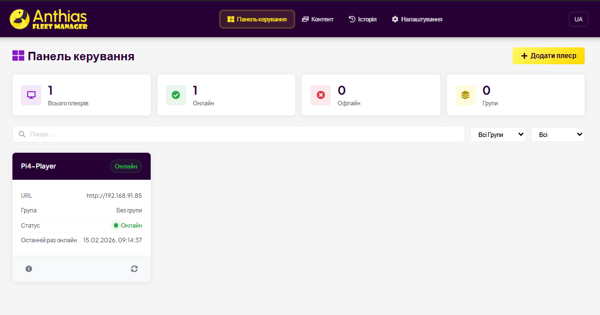
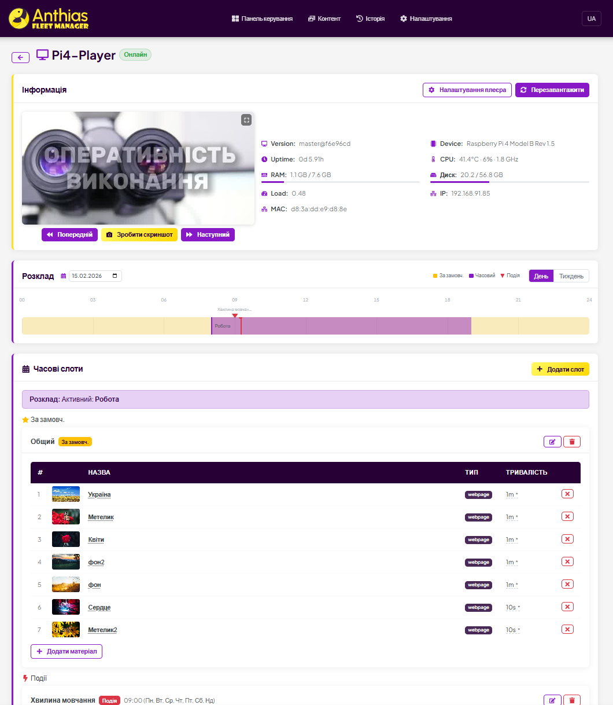
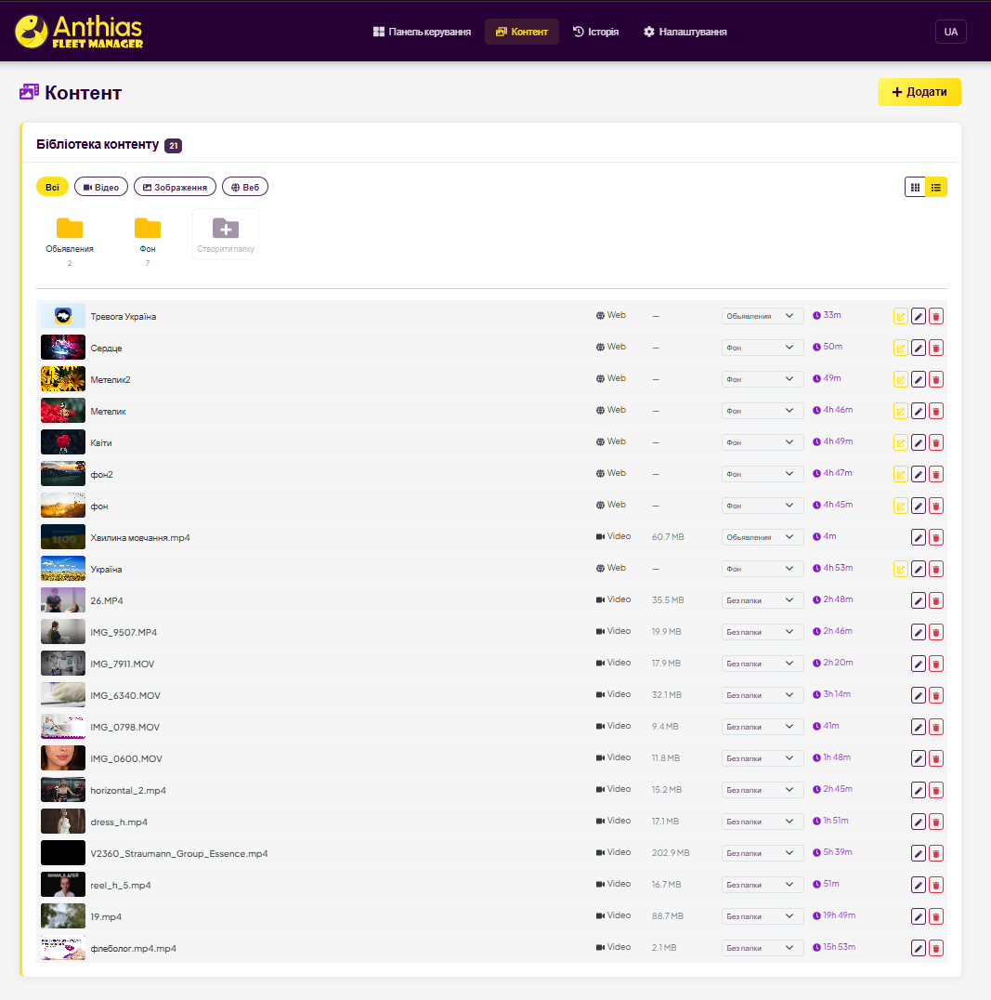
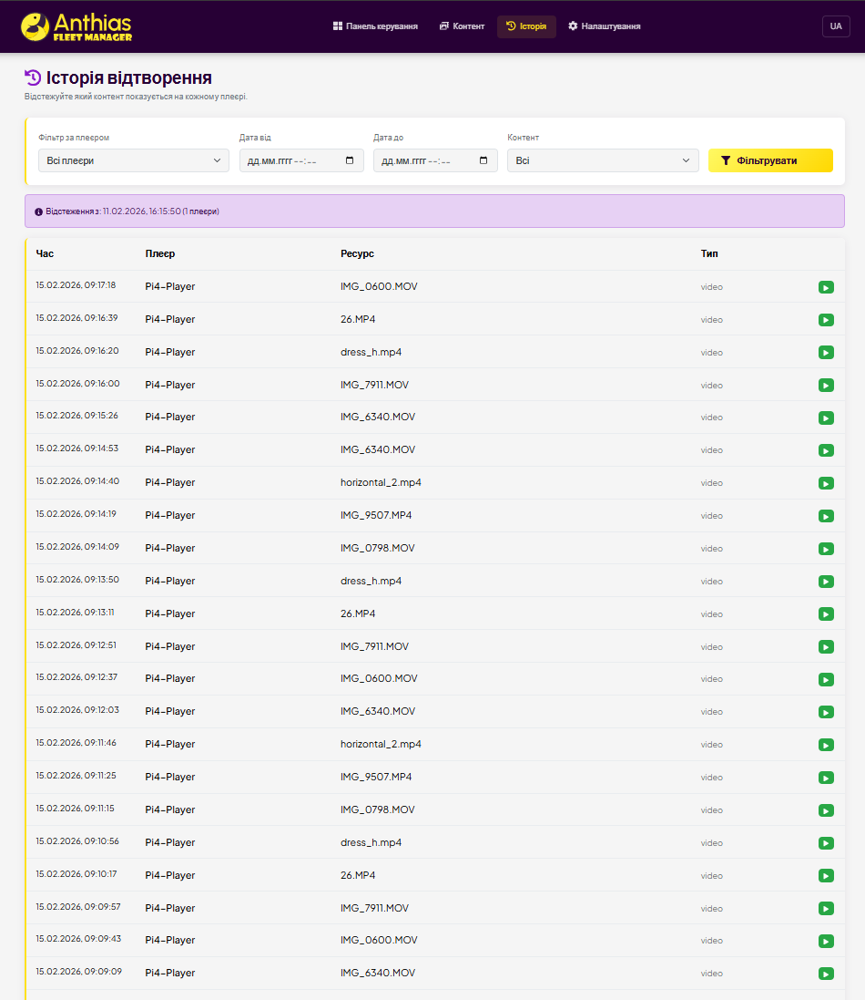
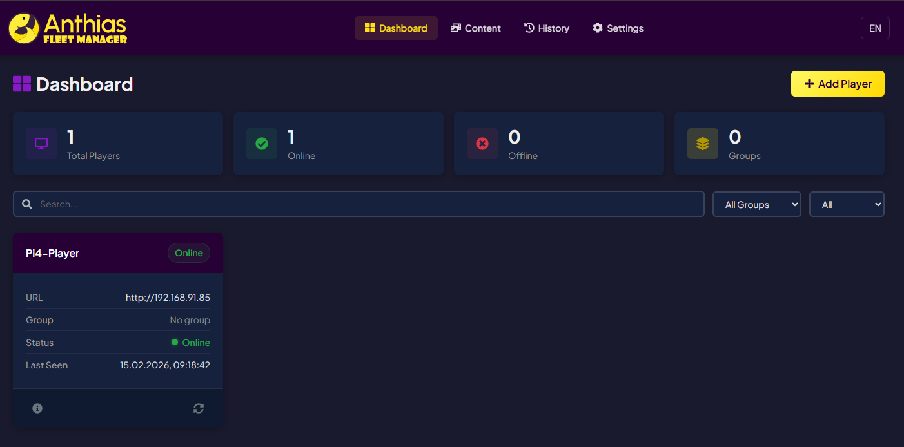

<p align="center">
  
</p>

<p align="center">
  Web-based management dashboard for <a href="https://github.com/Screenly/Anthias">Anthias</a> digital signage players.<br>
  Control your entire fleet of Raspberry Pi displays from a single interface.
</p>



## Features

### Player Management
Monitor all your Anthias players in real time. See online/offline status, CPU/disk usage, throttling warnings, and take live screenshots — including video frame capture.



### Content Library
Upload images, videos, and web pages. Organize content into folders, filter by type, and deploy to players with one click.



### Schedule Slots
Create flexible playback schedules for each player:
- **Default slot** — plays when nothing else is scheduled
- **Time slots** — play during specific hours on selected days
- **Event slots** — one-time or recurring events with highest priority

Visual timeline shows the full schedule at a glance.


### Remote Deploy
Push content to one or multiple players simultaneously. Track deployment progress in real time.

### Playback History
Track what content played on each player and when. Filter by player, date/time range, or content name.



### Player Groups
Organize players into color-coded groups for easier management and bulk operations.

### Dark Mode
Full dark and light theme support with automatic detection.



### Multi-language
Available in English, Ukrainian, French, German, and Polish.

## Tech Stack

| Layer | Technology |
|-------|-----------|
| Backend | Django 4.2 + Django REST Framework |
| Frontend | React 19 + TypeScript |
| UI | Bootstrap 5.3 + SASS |
| Task Queue | Celery + Redis |
| Database | PostgreSQL 16 |
| Deployment | Docker Compose |

## Quick Start

### Prerequisites

- Docker and Docker Compose
- Git

### Installation

```bash
git clone https://github.com/Alex1981-tech/Anthias-fleet-manager.git
cd Anthias-fleet-manager
cp .env.example .env
docker compose up -d --build
```

The application will be available at `http://localhost:9000`.

### Default Credentials

- **Username:** admin
- **Password:** admin

Change the password after first login.

### Environment Variables

| Variable | Default | Description |
|----------|---------|-------------|
| `DJANGO_SECRET_KEY` | auto-generated | Secret key (required in production) |
| `DJANGO_DEBUG` | `True` | Debug mode |
| `WEB_PORT` | `9000` | Host port for web interface |
| `DB_PASSWORD` | `fleet_manager_secret` | PostgreSQL password |
| `PLAYER_POLL_INTERVAL` | `60` | Player polling interval (seconds) |
| `ALLOWED_HOSTS` | `*` | Comma-separated allowed hosts |
| `CSRF_TRUSTED_ORIGINS` | — | Comma-separated trusted origins |

## Connecting Players

### Auto-Registration (Recommended)

Run this command on any Anthias player to enable automatic registration:

```bash
curl -s "http://YOUR_FM_SERVER:9000/api/players/install-phonehome/?server=http://YOUR_FM_SERVER:9000" | bash
```

The player will appear in Fleet Manager within 30 seconds.

### Manual Registration

1. Go to **Players** > **Add Player**
2. Enter the player's URL (e.g., `http://192.168.1.10`)
3. Enter credentials if the player has authentication enabled

## Screenshots

> **Note:** Replace the placeholder images above with actual screenshots.
> Place your screenshots in a `screenshots/` directory:
>
> ```
> screenshots/
> ├── dashboard.png
> ├── players.png
> ├── content.png
> ├── schedule.png
> ├── history.png
> └── dark-mode.png
> ```

## Development

### Frontend

```bash
npm install
npm run dev     # Watch mode with source maps
npm run build   # Production build
npm run lint    # ESLint
```

### Backend

```bash
pip install -r requirements.txt
python manage.py migrate
python manage.py runserver 0.0.0.0:9000
```

### Docker (rebuild after changes)

```bash
docker compose build web
docker compose up -d
```

## Architecture

```
┌──────────────┐     HTTP API      ┌──────────────────┐
│  Anthias     │◄──────────────────│  Fleet Manager   │
│  Player(s)   │   /api/v2/*       │                  │
│  Raspberry Pi│──────────────────►│  Django + React  │
│              │   phone-home      │  Docker Compose  │
└──────────────┘                   └──────────────────┘
```

Fleet Manager communicates with Anthias players via their HTTP API (`/api/v2/*`). Players can optionally phone home to register automatically.

## License

[MIT](LICENSE)
